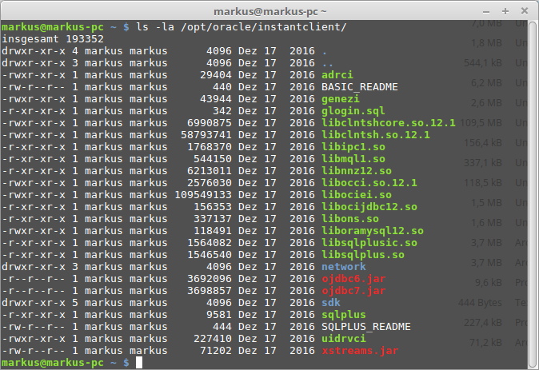

# Tutorium - Grundlagen Datenbanken
Dieses git repository beinhaltet alle Übungen zum Tutorium *Grundlagen Datenbanken* der Hochschule Trier für das Wintersemester 17/18.

# Einleitung
Das Tutorium *Grundlagen Datenbanken* wird wie folgt ablaufen. Die Studenten können sich die Übungen online auf [github.com](https://github.com) anschauen und herunterladen. Es wird empfohlen git zu installieren um das online repository zu klonen und Aktualisierungen des Projekts automatisch in Ihr geklontes Projekt einfließen zu lassen. Mehr dazu in Abschnitt ..

Nachdem die Studenten nun Einsicht in die Übungen haben, können Sie ich über Ihre zuvor angelegte Datenbank Kennung am Studentenserver anmelden. Die Einrichtung eines Zugangs zur Datenbank ist in Abschnitt .. beschrieben.

Der Author gibt bekannt, welche Übungen aus dem repository zur nächsten Veranstalltung abgearbeitet werden sollen.

## Installation
### VPN-Verbindung
Möchte man mit seinem privaten Rechner außerhalb des Netzwerkes der Hochschule Trier eine Verbindung zum Datenbankserver einrichten, ist es notwendig eine VPN-Verbindung aufzubauen. Die Hochschule Trier stellt dazu Anleitungen für mehrere Betriebssysteme bereit. Eine Liste von Anleitungen ist zu finden auf der [Internetseite](https://helpdesk.hochschule-trier.de/otrs/public.pl?Action=PublicFAQSearch;Subaction=Search;Keyword=vpn) der Hochschule.

### SQL-Plus
SQL-Plus zu installieren wird ein Oracle-Account benötigt. Dies kann auf der Internetseite von Oracle [erstellt](https://profile.oracle.com/myprofile/account/create-account.jspx) werden. Nach der Registrierung und erfolgreichem Login kann das Programm sqlplus von Oracle's offiziellen [Paketquellen](http://www.oracle.com/technetwork/database/features/instant-client/index-097480.html) bezogen werden. Es ist für mehrere Betriebssysteme vorhanden. Es wird die Installation von SQL-Plus auf Linux und Windows in den weiteren Abschnitten beschrieben.

#### Linux (Debian/Ubuntu/Linux Mint)
Laden Sie von den offiziellen [Paketquellen](http://www.oracle.com/technetwork/topics/linuxx86-64soft-092277.html) das ZIP-Archiv *instantclient-basic-linux.x64.zip* herunter. Dieses ZIP-Archiv enthält die Basis Applikation. Laden sie anschließend aus den [Paketquellen](http://www.oracle.com/technetwork/topics/linuxx86-64soft-092277.html) die SQL-Plus Erweiterung als ZIP-Archiv herunter mit dem Namen *instantclient-sqlplus-linux.x64.zip*.

Verschieben Sie den Inhalt beider Archive in Verzeichnis. Das Verzeichnis sollte einen ähnlichen Inhalt aufweisen wie auf dem folgendem Abbild zu erkennen. Das Verzeichnis `network` wird später angelegt.



Verschieben Sie das Verzeichnis unter `/opt/oracle` Falls das Verzeichnis `/opt/oracle` nicht vorhanden ist, legen Sie es an.

Öffnen sie die Datei `~/.bashrc` und fügen Sie am Ende der Datei folgendes ein.
```bash
export PATH="$PATH:/opt/oracle/instantclient"
export LD_LIBRARY_PATH="/opt/oracle/instantclient"
export ORACLE_HOME="/opt/oracle/instantclient"
export ORACLE_BASE="/opt/oracle/instantclient"
export NLS_LANG="GERMAN_GERMANY.UTF8"
export TNS_ADMIN="/opt/oracle/instantclient/network/admin"
```

Hier durch wird ermöglicht, dass sie über das Terminal SQL-Plus in der richtigen Sprache ausführen können. Erstellen sie zum Verbindungsaufbau zu der Oracle Datenbank der Hochschule das Verzeichnis `/opt/oracle/instantclient/network/admin` und kopieren sie dort die Datei `tns.ora` hin, die im Vorlesungsverzeichnis Ihres Dozenten hinterlegt ist.

Nachdem sie den Rechner neugestartet haben oder im Terminal ihre bash durch den Befehl `bash` aktualisiert haben, sollten sie in der Lage sein, SQL-Plus im Terminal auszuführen.

Melden sie sich mit ihren Zugangsdaten am Datenbankserver an.

Beispiel: `sqlplus max.mustermann@pdublin1`

##### Troubleshooting
Je nach Einstellung der bash kann es dazu kommen, dass das Arbeiten mit Zeilenumbrüchen sich acls schwierig erweißt. Abhilfe kann hier das Programm `rlwrap` schaffen. Installieren sie `rlwrap` mit
```bash
sudo apt-get update;
sudo apt-get dist-upgrade;
sudo apt-get install rlwrap;
```

Setzen die `rlwrap` im Terminal vor den Aufruf von SQL-Plus.

Beispiel: `rlwrap sqlplus max.mustermann@pdublin1`

#### Windows

### git


