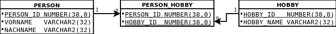

# Tutorium - Grundlagen Datenbanken - Blatt 2

## Vorbereitungen
* Für dieses Aufgabenblatt wird die SQL-Dump-Datei `tutorium.sql` benötigt, die sich im Verzeichnis `sql` befindet.
* Die SQL-Dump-Datei wird in SQL-Plus mittels `start <Dateipfad/zur/sql-dump-datei.sql>` in die Datenbank importiert.
* Beispiele
  * Linux `start ~/Tutorium.sql`
  * Windows `start C:\Users\max.mustermann\Desktop\Tutorium.sql`

## Datenbankmodell


## Aufgaben

### Aufgabe 1
Schaue dir das Datenbankmodell an. Wofür steht hinter dem Datentyp `NUMBER` die Zahlen in den runden Klammern?
Nehme dir die Oracle [Dokumentation](https://docs.oracle.com/cd/B28359_01/server.111/b28318/datatype.htm#CNCPT012) zu Hilfe.

#### Lösung
Die maximal zulässige Zeichenanzahl wird angegeben.

### Aufgabe 2
Was bedeuten die durchgezogenen Linien, die zwischen einigen Tabellen abgebildet sind?

#### Lösung
Sie zeigen an welche Relationen zwischen den Tabellen sind. Beispielsweise 1:n-Beziehung.

### Aufgabe 3
Was bedeutet die gestrichelte Linie, die zwischen der Tabelle `ACC_VEHIC` und `GAS_STATION` abgebildet ist?

#### Lösung
Nur Werte aus dem Attribut DEFAULT_GAS_STATION können in der Tabelle GAS_STATION eingetragen werden.

### Aufgabe 4
Die folgende Abbildung beschreibt eine Beziehung zwischen Tabellen. Sie wird auch `n` zu `m` Beziehung genannt. Beschreibe kurz die Bedeutung dieser Beziehung.
Nehme dir diesen [Artikel](https://glossar.hs-augsburg.de/Beziehungstypen) zu Hilfe.



Zur Realisierung einer n zu m-Beziehung wird eine zusätzliche Tabelle erstellt in der die Primärschlüssel beider Tabellen als Fremdschlüssel enthalten sind. Die zusätzliches Tabelle ist somit eine 1:n-Beziehung.

### Aufgabe 5
Was bedeutet der Buchstabe `P` und `F` neben den Attributen von Tabellen?

#### Lösung
P = Primärschlüssel  
F = Fremdschlüssel


### Aufgabe 6
Importiere die SQL-Dump-Datei in dein eigenes Schema. Wie lautet dazu der Befehl um dem import zu starten?

#### Lösung
```@C:\Users\User\workspace\github.com\RoseTyler\tgdb_ws1718\sql\tutorium.sql
Oder durch start + Link```

### Aufgabe 7
Gebe alle Datensätze der Tabelle `ACCOUNT` aus.

#### Lösung
```SELECT * 
FROM ACCOUNT;```

### Aufgabe 8
Modifiziere Aufgabe 7 so, dass nur die Spalte `ACCOUNT_ID` ausgegeben wird.

#### Lösung
```SELECT ACCOUNT_ID 
FROM ACCOUNT;```

### Aufgabe 9
Gebe alle Spalten der Tabelle `VEHICLE` aus.

#### Lösung
```DESC VEHICLE;```

### Aufgabe 10
Kombiniere Aufgabe 8 und 9 so, dass nur Personen (`ACCOUNT`) angezeigt werden, die ein Auto (`VEHICLE`) besitzen.

#### Lösung
```SELECT DISTINCT ac.surname 
FROM ACCOUNT ac
INNER JOIN ACC_VEHIC ve 
ON ac.ACCOUNT_ID = ve.ACCOUNT_ID;```

### Aufgabe 11
Modifizierde die Aufgabe 10 so, dass nur die Person mit der `ACCOUNT_ID` = `7` angezeigt wird.

#### Lösung
```sql
Deine Lösung
```

### Aufgabe 12
Erstelle für dich einen neuen Benutzer.
> Achtung, nutze für die Spalten `C_DATE` und `U_DATE` vorerst die Syntax `SYSDATE` - [Dokumentation](https://docs.oracle.com/cd/B19306_01/server.102/b14200/functions172.htm)

#### Lösung
```SELECT DISTINCT ac.surname 
FROM ACCOUNT ac
INNER JOIN ACC_VEHIC ve 
ON ac.ACCOUNT_ID = 7;```

### Aufgabe 13
Erstelle für deinen neuen Benutzer ein neues Auto. Dieses Auto dient als Vorlage für die nächten Aufgaben.

#### Lösung
```INSERT INTO ACCOUNT
VALUES (
  (SELECT MAX(ACCOUNT_ID)+1 FROM ACCOUNT),
   'Tyler','Rose','tylerr@hochschule-trier.de',
   SYSDATE,SYSDATE);```

### Aufgabe 14
Verknüpfe das aus Aufgabe 13 erstellte neue Auto mit deinem neuen Benutzer aus Aufgabe 11 in der Tabelle `ACC_VEHIC` und erstelle den ersten Rechnungsbeleg.

#### Lösung
```INSERT INTO VEHICLE
VALUES (
  (SELECT MAX(VEHICLE_ID)+1 FROM VEHICLE),
   1, 2, '3', NULL, 300,'15-SEP-17', 4, SYSDATE, SYSDATE);```

### Aufgabe 15
Ändere den Vorname `SURNAME` des Datensatzes mit der ID `7` in der Tabelle `ACCOUNT` auf `Zimmermann`.

#### Lösung
```UPDATE ACCOUNT 
SET SURNAME = 'Zimmermann' 
WHERE ACCOUNT_ID = 7;```

### Aufgabe 16
Speichere alle Änderungen deiner offenen Transaktion. Wie lautet der SQL-Befehl dazu?

#### Lösung
```COMMIT;```
