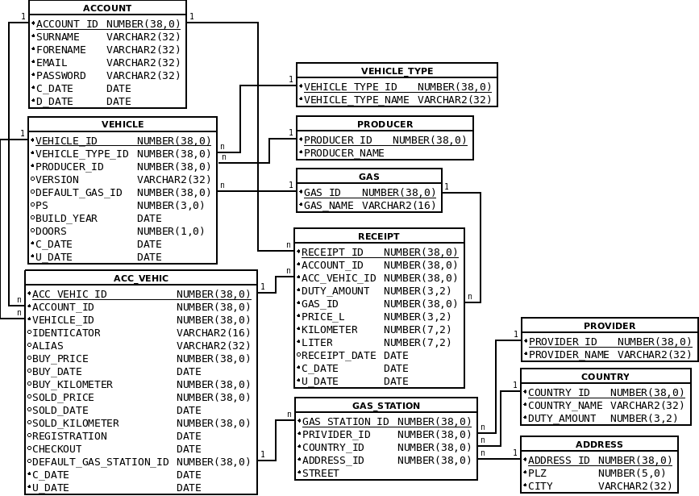

# Tutorium - Grundlagen Datenbanken - Blatt 2

## Vorbereitungen
* Für dieses Aufgabenblatt wird die SQL-Dump-Datei `uebung02.sql` benötigt, die sich im Verzeichnis `sql` befindet.
* Die SQL-Dump-Datei wird in SQL-Plus mittels `start <Dateipfad/zur/sql-dump-datei.sql>` in die Datenbank importiert.
* Beispiele
  * Linux `start ~/Tutorium.sql`
  * Windows `start C:\Users\max.mustermann\Desktop\Tutorium.sql`

## Datenbankmodell

## Aufgaben

### Aufgabe 1
Schaue dir das Datenbankmodell an. Wofür steht hinter dem Datentyp `NUMBER` die Zahlen in den runden Klammern?

#### Lösung
> Deine schritliche Antwort.

### Aufgabe 2
Was bedeuten an den schwarzen Linien die im Datenbankmodell Tabellen miteinander verknüpfen `1` und `n`?

#### Lösung
> Deine schriftliche Antwort.

### Aufgabe 3
Die folgende Abbildung beschreibt eine Beziehung zwischen Tabellen. Sie wird auch `n` zu `m` Beziehung genannt. Beschreiben Sie kurz die Bedeutung dieser `n` zu `m` Beziehung.

> Deine schriftliche Antwort.

### Aufgabe 4
