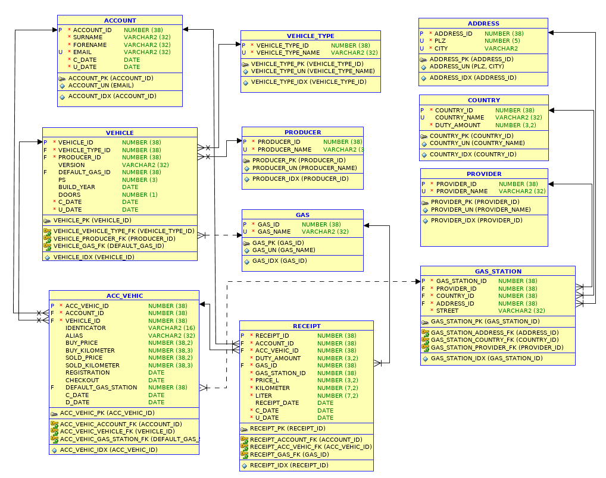

# Tutorium - Grundlagen Datenbanken - Blatt 4

## Vorbereitungen
* Für dieses Aufgabenblatt wird die SQL-Dump-Datei `tutorium.sql` benötigt, die sich im Verzeichnis `sql` befindet.
* Die SQL-Dump-Datei wird in SQL-Plus mittels `start <Dateipfad/zur/sql-dump-datei.sql>` in die Datenbank importiert.
* Beispiele
  * Linux `start ~/Tutorium.sql`
  * Windows `start C:\Users\max.mustermann\Desktop\Tutorium.sql`

## Datenbankmodell


## Aufgaben

### Aufgabe 1
Um genauere Informationen und Prognosen mit Data Mining Werkzeugen zu schöpfen, ist es notwendig mehr Informationen über die registrierten Benutzer zu sammeln und zu speichern. Die in Zukunft gesammelten Informationen sollen in neuen Tabellen des bestehenden Datenbankmodells gespeichert werden. Dazu soll jedem Benutzer einen Erst- und Zweitwohnsitz zugeordnet werden. Jeder Wohnsitz besitzt eine eigene Adresse. Integriere in das bestehende Datenbankmodell Tabellen die den genauen Erst- und Zweitwohnsitz abbilden können. Beachte dazu die Normalisierungsformen bis 3NF - [Dokumentation](https://de.wikipedia.org/wiki/Normalisierung_(Datenbank)). Wie lautet deine SQL-Syntax um deine Erweiterung des Datenbankmodells zu implementieren?

#### Lösung
```sql
CREATE TABLE ACC_ADD (
  ACC_ADD_ID  NUMBER(38) NOT NULL,
  ACCOUNT_ID  NUMBER(38) NOT NULL,
  STREET      VARCHAR2(32) NOT NULL,
  ADDRESS_ID  NUMBER(38) NOT NULL,
  COUNTRY_ID  NUMBER(38) NOT NULL
);

ALTER TABLE ACC_ADD ADD CONSTRAINT PK_ACC_ADD PRIMARY KEY (ACC_ADD_ID)
ALTER TABLE ACC_ADD ADD CONSTRAINT UN_ACC_ADD UNIQUE (ACCOUNT_ID, STREET, ADDRESS_ID, COUNTRY_ID);
ALTER TABLE ACC_ADD ADD CONSTRAINT FK_ACC_ADD_ACCOUNT_ID FOREIGN KEY (ACCOUNT_ID) REFERENCES ACCOUNT(ACCOUNT_ID);
ALTER TABLE ACC_ADD ADD CONSTRAINT FK_ACC_ADD_ADDRESS_ID FOREIGN KEY (ADDRESS_ID) REFERENCES ADDRESS(ADDRESS_ID);
```

### Aufgabe 2
Als App Entwickler/in für Android und iOS möchtest du dich nicht darauf verlassen, dass die Adresse exakt richtig ist und überlegst in dem Datenbankmodell noch zwei zusätzliche Attribute (X und Y Koordinate) zur genauen GPS Lokalisierung einer Tankstelle aufzunehmen. Wie lautet deine SQL-Syntax um das Datenbankmodell auf die zwei Attribute zu erweitern?

#### Lösung
```sql
ALTER TABLE GAS_STATION
ADD (
  GEO_X   NUMBER(9,3),
  GEO_Y   NUMBER(9,3)
);
```

### Aufgabe 3
Welche Kunden haben im Jahr 2017 mehr als den Durchschnitt getank?

#### Lösung
```sql
SELECT a.forename "Vorname", a.surname "Nachname",
  (
    SELECT AVG(price_l * liter * duty_amount)
    FROM receipt
    WHERE account_id = a.account_id
    AND TO_CHAR(receipt_date, 'YYYY') = '2017'
  ) "AVERAGE"
FROM account a
WHERE a.account_id IN (
  SELECT account_id
  FROM receipt k
  GROUP BY account_id
  HAVING AVG((price_l * liter)* duty_amount) > (
    SELECT AVG((r.price_l * r.liter)* r.duty_amount)
    FROM receipt r
    WHERE TO_CHAR(receipt_date, 'YYYY') = '2017'
  )
);
```

### Aufgabe 4
Ermittle, warum du INSERT-Rechte auf die Tabelle `SCOTT.EMP` und UPDATE-Rechte auf die Tabelle `SCOTT.DEPT` besitzt. Beantworte dazu schrittweise die Aufgaben von 4.1 bis 4.4.

#### Aufgabe 4.1
Wurden die Tabellen-Rechte direkt an dich bzw. an `PUBLIC` vergeben?

##### Lösung
```sql
SELECT table_name, privilege, grantee
FROM all_tab_privs
WHERE table_name IN ('DEPT','EMP')
AND table_schema LIKE 'SCOTT'
AND grantee IN ('PESCHM', 'PUBLIC');

-- Styling für sqlplus
COLUMN SCHEMA FORMAT a15
COLUMN Tabelle FORMAT a15
COLUMN Recht FORMAT a15
COLUMN GRANTEE FORMAT a15

SELECT table_schema Schema, table_name Tabelle, privilege Recht, grantee
FROM all_tab_privs
WHERE table_name IN ('DEPT','EMP')
AND table_schema LIKE 'SCOTT'
AND grantee IN (
  (
    SELECT USER
    FROM DUAL
  ),
  (
    SELECT granted_role
    FROM user_role_privs
  ),
  'PUBLIC'
);
```

#### Aufgabe 4.2
Welche Rollen besitzt du direkt?

##### Lösung
```sql
SELECT granted_role, default_role
FROM user_role_privs;
```

#### Aufgabe 4.3
Welche Rollen haben die Rollen?

##### Lösung
```sql
SELECT role , granted_role
FROM role_role_privs
WHERE role IN ('BW_STUDENT', 'FH_TRIER');
```

#### Aufgabe 4.4
Haben die Rollen Rechte an `SCOTT.EMP` oder `SCOTT.DEPT`?

##### Lösung
```sql
SELECT *
FROM role_tab_privs
WHERE role IN ('BW_STUDENT','STUDENT','BASTUDENT','FH_TRIER')
AND owner LIKE 'SCOTT'
AND table_name IN ('EMP','DEPT');
```

### Aufgabe 5
Es soll für jede Tankstelle der Umsatz einzelner Jahre aufgelistet werden auf Basis der Daten, die Benutzer durch ihre Quittungen eingegeben haben. Sortiere erst nach Jahr und anschließend nach der Tankstelle. Beispiel:

| Jahr  | Anbieter  | Straße            | PLZ   | Stadt | Land          | Umsatz    |
| ----- | --------- | ----------------- | ----- | ----- | --------------| --------- |
| 2017  | Esso      | Triererstraße 15  | 54292 | Trier | Deutschland   | 54784.14  |
| 2017  | Shell     | Zurmainerstraße 1 | 54292 | Trier | Deutschland   | 67874.78  |
| 2016  | Esso      | Triererstraße 15  | 54292 | Trier | Deutschland   | 57412.66  |
| 2016  | Shell     | Zurmainerstraße 1 | 54292 | Trier | Deutschland   | 72478.42  |

#### Lösung
```sql
SELECT TO_CHAR(r.receipt_date, 'YYYY'), p.provider_name, gs.street, a.plz, a.city, c.country_name, CONCAT(ROUND(SUM(price_l * liter),2), ' €') AS "Umsatz"
FROM receipt r
  INNER JOIN gas_station gs ON (r.gas_station_id = gs.gas_station_id)
  INNER JOIN country c ON (gs.country_id = c.country_id)
  INNER JOIN address a ON (gs.address_id = a.address_id)
  INNER JOIN provider p ON (gs.provider_id = p.provider_id)
GROUP BY TO_CHAR(r.receipt_date, 'YYYY'), p.provider_name, gs.street, a.plz, a.city, c.country_name;
```


