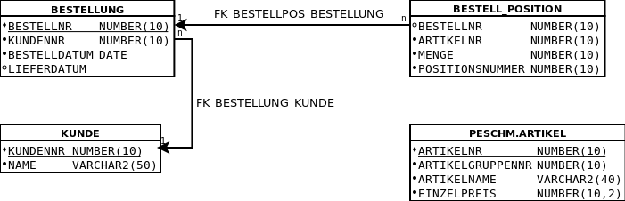

# Tutorium - Grundlagen Datenbanken - Blatt 12


## Vorbereitungen
* Für dieses Aufgabenblatt wird die SQL-Dump-Datei `schema_uebung_12.sql` benötigt, die sich im Verzeichnis `sql` befindet.
* Die SQL-Dump-Datei wird in SQL-Plus mittels `start <Dateipfad/zur/sql-dump-datei.sql>` in die Datenbank importiert.
* Beispiele
  * Linux `start ~/Tutorium.sql`
  * Windows `start C:\Users\max.mustermann\Desktop\Tutorium.sql`

## Datenbankmodell


## Aufgaben
Diese Aufgaben lehnen sich an eine Altklausur an. Jede Aufgabe gibt 5 Punkte. 1 Punkt entspricht einer Bearbeitungszeit von 1 Minute. Bei 13 Aufgaben entspricht das 65 Minuten. Versuchen Sie die 13 Aufgaben binnen 65 Minuten zu lösen.

### Aufgabe 1
Sie haben ein `SELECT`-Recht auf die Tabelle `ARTIKEL` im Schema `peschm` - Warum?

#### Lösung
```sql
Deine Lösung
```

### Aufgabe 2
Legen Sie ein Synonym mit Namen `ARTIKEL` für die Tabelle an aus Aufgabe 1 und bestimmen Sie die Anzahl der Artikel in dieser Tabelle.

#### Lösung
```sql
Deine Lösung
```

### Aufgabe 3a
Ergänzen Sie das Skript um ein geeignetes `CREATE TABLE` Statement für die Tabelle `BESTELLUNG`, das zur obigen Grafik passt, einschließlich `PRIMARY KEY`. Die `FOREIGN KEYS`  werden in Aufgabe 3b angelegt. Starten Sie anschließend das Skript.

#### Lösung
```sql
Deine Lösung
```

### Aufgabe 3b
Implementieren Sie alle Foreign key Konstrukte, die in der obigen Grafik dargestellt sind mit geeigneten delete rules.

#### Lösung
```sql
Deine Lösung
```

### Aufgabe 4
Überprüfen Sie mit einem SQL Statement, ob alle Artikelnr in `BESTELL_POSITION` in der Tabelle DWH.ARTIKEL vorkommen.

#### Lösung
```sql
Deine Lösung
```

### Aufgabe 5
Stellen Sie sicher, dass das Attribut `MENGE` in der Tabelle `BESTELL_POSITION` nur positive Zahlen kleiner als `10` enthalten kann.

#### Lösung
```sql
Deine Lösung
```

### Aufgabe 6
Schreiben Sie eine `STORED PROCEDURE` mit geeigneter Fehlerbehandlung, die als Parameter eine Bestellnummer erwartet und den Gesamtwert über alle Bestellpositionen der Bestellung ausgibt. Die Einzelpreise befinden sich in der Tabelle `PESCHM.ARTIKEL` oder ihrem zuvor angelegtem Synonym.

#### Lösung
```sql
Deine Lösung
```

### Aufgabe 7
Stellen Sie sicher, dass eine neue Bestellung in die Tabelle `BESTELLUNG` nur eingetragen werden kann, indem automatisch der nächste Wert aus einer Sequence `BESTELLUNG_SEQ` als `BESTELLNR` genommen wird, die Sie auch noch anlegen müssen mit Startwert `30000` und increment `10`!

#### Lösung
```sql
Deine Lösung
```

### Aufgabe 8
Beantworten Sie die folgenden Aufgaben mit einem SQL-Befehl:

#### Aufgabe 8a
Geben Sie alle Kunden aus mit der Anzahl ihrer Bestellungen!

#### Lösung
```sql
Deine Lösung
```

#### Aufgabe 8b
Tragen Sie in der Bestellung mit Nr `19366` ein Lieferdatum ein, das neun Tage in der Zukunft liegt von heute aus gesehen!

#### Lösung
```sql
Deine Lösung
```

#### Aufgabe 8c
Welcher Kunde hat am meisten Bestellungen aufgegeben?

#### Lösung
```sql
Deine Lösung
```

#### Aufgabe 8d
Geben Sie Kunden aus, die keine Bestellung aufgegeben haben!

#### Lösung
```sql
Deine Lösung
```

#### Aufgabe 8e
Welcher Kunde hat den größten Bestellwert generiert?

#### Lösung
```sql
Deine Lösung
```

